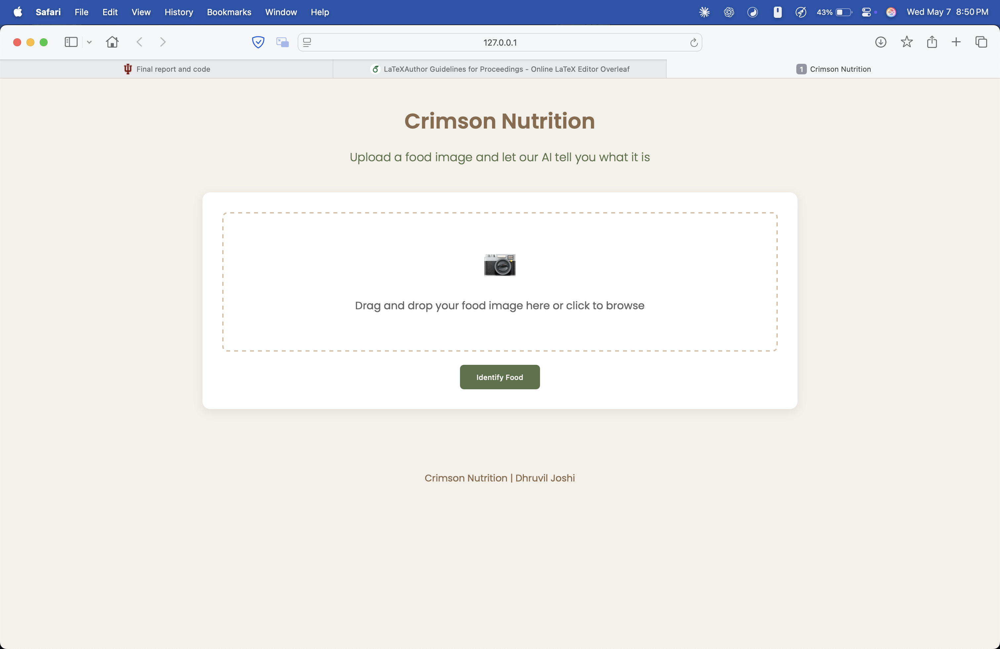
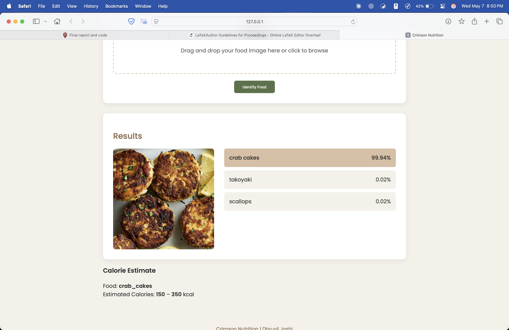

# Crimson Nutrition

## Overview
Crimson Nutrition is a web application that utilizes computer vision to identify food items from images and retrieve their nutritional information. Users can upload or scan a photo of their food, and our model will classify it, fetching key nutritional details such as calories, protein, vitamins, and more from a relational database.

This project serves as a foundation for future expansions, ensuring a practical and user-friendly experience from the start.


## App screenshots


<p align="center">
  
  &nbsp;&nbsp;&nbsp;
  
</p>
<p align="center">
  <em>Left: Home page of Crimson Nutrition showing the main dashboard.<br>
  Right: Upload page where users can submit food images for analysis.</em>
</p>


## Team Members
- **Dhruvil Joshi** (joshidh@iu.edu)
- **Arju Singh** (singarju@iu.edu)

## How to Run this locally

We haven't yet deployed the site since there's few things still left to do. (The Computer Vision Part is done but still working on proper app features)

We have also given the trained model for ResNet-50, MobileNet-V2 in the repository.

1. Create a virtual environment in python (recommended)
2. Download the required libraries/packages
    ```pip install -r requirements.txt```
3. Create a .env file in the project root to store the Groq API Key 

    ```GROQ_API_KEY=your_groq_api_key_here```

4. Run the command 
    ```python3 app.py```
5. Access the web application on your local host

    Uploaded images are stored in the static/uploads directory.
    Maximum upload size is 16MB.

## Contact
If you find anything not working or help setting up project, feel free to contact us.